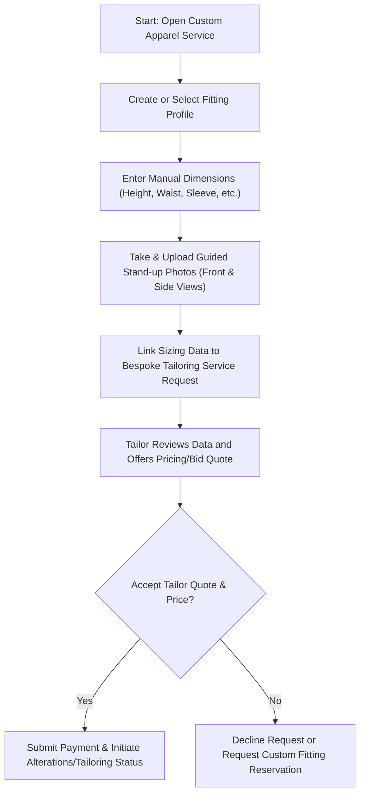
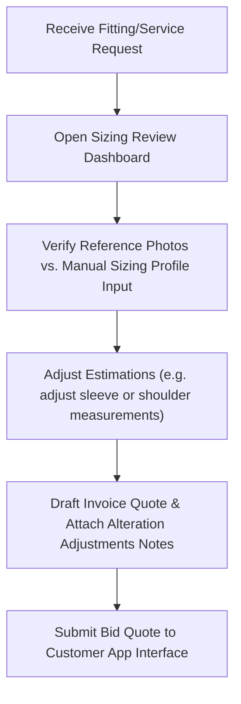

# Urban Goodz Fashion, Tailor & Photo-Assisted Measurement Hand-Off Documentation

This document describes the architecture, workflows, backend schemas, API structures, privacy guidelines, and future expansion paths for the **Urban Goodz Custom Apparel & Sizing Hub**.

---

## 1. User/Customer Workflow

1. **Category/Store Navigation**: Customer navigates to a custom fashion designer, tailor shop, or alterations boutique module/store card on the Urban Goodz Marketplace.
2. **Profile Set-up**: Customer enters height, waist, bust, hip, inseam, sleeve length, neck, shoulder width, preferred fit type (slim/regular/loose), and optional notes.
3. **Reference Photo Upload**: Customer is guided to take two full-length posture photos (front and side) standing against a plain backdrop, with their camera positioned at chest height.
4. **Linkage & Request**: Sizing dimensions are automatically packaged into a `MeasurementRequestModel` and sent to the selected designer along with service details.
5. **Bid/Quote Acceptance**: User reviews tailor comments (e.g. adjustments), accepts quote pricing, pays, and tracks tailoring status directly in the app.

---

## 2. Provider/Tailor Workflow

1. **Request Intake**: Tailor receives a notification that a new bespoke order is pending measurement review.
2. **Visual Inspection**: Tailor reviews the front/side photos in the provider dashboard to evaluate the customer's posture, silhouette, and proportion.
3. **Measurement Adjustments**: Tailor reviews the customer's self-reported measurements and photo references to prepare fit estimates for custom work.
4. **Draft Bid Quote**: Tailor writes service adjustments, estimated turnaround times, and submits a final price quote.

---

## 3. Recommended Backend Tables

### `fashion_measurement_profiles`
Stores the manual body dimensions saved for reuse across custom clothing purchases.
* `id` (bigint, PK)
* `user_id` (bigint, FK to users)
* `profile_name` (varchar) - e.g. "Formal Tuxedo Fit"
* `height` (double) - in inches or cm
* `chest_bust` (double)
* `waist` (double)
* `hips` (double)
* `inseam` (double)
* `sleeve` (double)
* `shoulder_width` (double)
* `neck` (double)
* `preferred_fit` (varchar) - slim, regular, loose
* `notes` (text)
* `created_at` / `updated_at` (timestamps)

### `fashion_measurement_photos`
Manages references to secure storage URLs for front and side body posture reference photos.
* `id` (bigint, PK)
* `user_id` (bigint, FK to users)
* `photo_url` (varchar) - private secure S3 file path
* `orientation` (varchar) - "front", "side", "back"
* `height_ref` (double) - height of user at time of photo session for scaling
* `status` (varchar) - "pending", "approved", "rejected"
* `created_at` / `updated_at` (timestamps)

### `fashion_measurement_requests`
Links profiles and photos together to represent a single tailoring request.
* `id` (bigint, PK)
* `user_id` (bigint, FK to users)
* `profile_id` (bigint, FK to fashion_measurement_profiles)
* `front_photo_id` (bigint, FK to fashion_measurement_photos, nullable)
* `side_photo_id` (bigint, FK to fashion_measurement_photos, nullable)
* `notes` (text)
* `status` (varchar) - "pending", "reviewed", "rejected"
* `created_at` (timestamp)

### `fashion_tailor_services`
Defines tailor services listed by providers.
* `id` (bigint, PK)
* `store_id` (bigint, FK to stores)
* `service_name` (varchar)
* `description` (text)
* `base_price` (double)
* `duration_days` (int)

### `fashion_tailor_quotes`
Manages quotes generated by tailors in response to requests.
* `id` (bigint, PK)
* `request_id` (bigint, FK to fashion_measurement_requests)
* `service_id` (bigint, FK to fashion_tailor_services)
* `quote_amount` (double)
* `comments` (text)
* `is_accepted` (boolean)
* `created_at` (timestamp)

---

## 4. Recommended API Endpoints

### Sizing Profiles (CRUD)
* `GET /api/v1/customer/fashion/measurement-profiles` - Get user sizing profiles.
* `POST /api/v1/customer/fashion/measurement-profiles` - Save/update sizing profile.
* `DELETE /api/v1/customer/fashion/measurement-profiles/{id}` - Delete profile.

### Posture Reference Photos
* `POST /api/v1/customer/fashion/measurement-photos/upload` - Upload body photo (multipart form data).
* `GET /api/v1/customer/fashion/measurement-photos` - Fetch list of user's uploaded reference photos.

### Sizing Requests & Quotes
* `POST /api/v1/customer/fashion/measurement-requests` - Submit requests to tailor.
* `GET /api/v1/customer/fashion/measurement-requests/{id}/quotes` - Get tailor quotes for a request.
* `POST /api/v1/customer/fashion/tailor-quotes/{id}/accept` - Accept quote and invoice.

---

## 5. Photo Privacy & Safety Notes
- **Encrypted Storage**: Photos must be stored in encrypted private buckets (e.g. AWS S3 private buckets) with signed short-lived URL generation to prevent public exposure.
- **Strict Authorization**: Only the specific customer who owns the photos and the target tailor assigned to review the order have access to view the image assets.
- **Retention Policy**: Photos should be automatically deleted from servers 30 days after the final alteration order status is completed or cancelled.
- **Moderate Guidelines**: Do not allow face, background, or inappropriate content to be exposed. Use face-blurring or silhouette processing if needed in subsequent builds.

---

## 6. Sizing Disclaimer (App Copy)
> "All measurements and posture photos are used exclusively as a photo-assisted sizing estimate. Final fit adjustments are verified and approved by the tailor/designer before fabric preparation begins. Urban Goodz does not guarantee medical or laser-scan accuracy."

---

## 7. Future AI Integration Plan
1. **Silhouette Edge Detection**: Implement client-side computer vision (TFLite or MobileNet) to detect silhouette edges, verifying standing posture against grid overlays.
2. **Scaling Calibration**: Use the customer's input height reference and a physical reference object (like a door height or floor line) to calibrate pixel-to-inch ratios dynamically.
3. **Mesh Fitting**: Render 3D avatars matching chest, waist, and hip ratios to let customers preview clothes drape prior to ordering.

---

## 8. Cross-Module Integration Points

### Retail / Shopping
- When purchasing dresses, jackets, or suits from local boutiques, display a **"Photo-Assisted Sizing Profile"** checkout action.
- Allows buyers to click "Send Sizing Profile" to request alteration estimates directly from the merchant during order placement.

### Beauty Supply & Hair Providers
- Enables hair designers or wig tailors to request head circumferences, front-to-nape lengths, and side head photos to build custom wigs or hair bundles that fit precisely.

### Creator Commerce
- Allow creators to offer limited-run custom merch, uniform designs, or bespoke costume garments. Creators can request buyer sizing profiles to minimize return rates and fabric waste.
